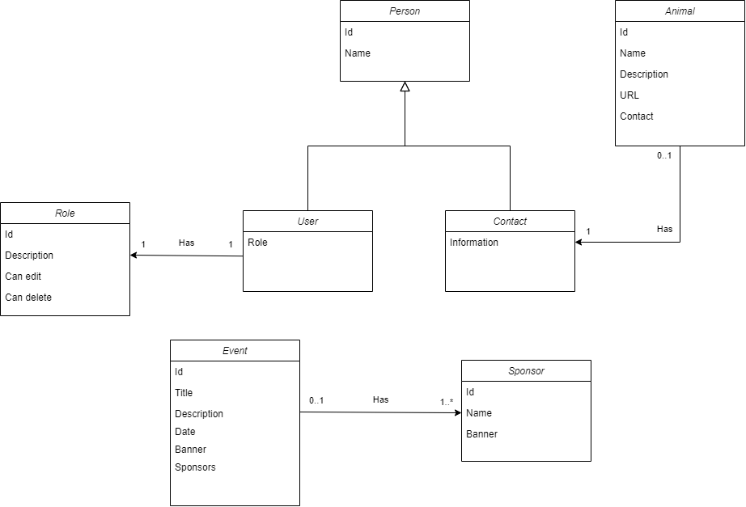

# Overview

Web application built using dotNet for a dog adoption ONG.

# Class diagram



# Proposed End Points

```
Animals:

GET /api/animal
GET /api/animal/{id}
POST /api/animal
PUT /api/animal/{id}
DELETE /api/animal/{id}

Contacts:

DELETE /api/animal/{id}/contact/{id}

Users:

GET /api/user
POST /api/user
PUT /api/user/{id}
DELETE /api/user/{id}

Sponsors:

GET /api/sponsor
POST /api/sponsor
PUT /api/sponsor/{id}
DELETE /api/sponsor/{id}

Events:

GET /api/event
POST /api/event
PUT /api/event/{id}
DELETE /api/event/{id}
```
